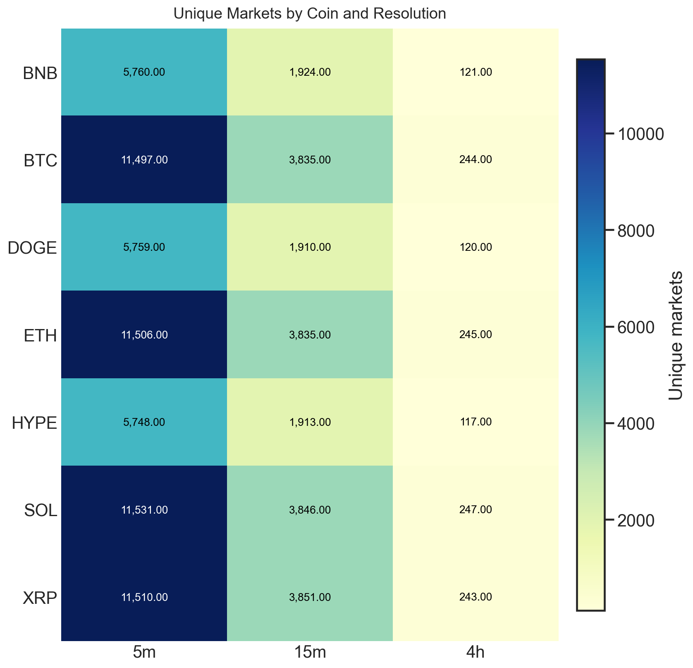
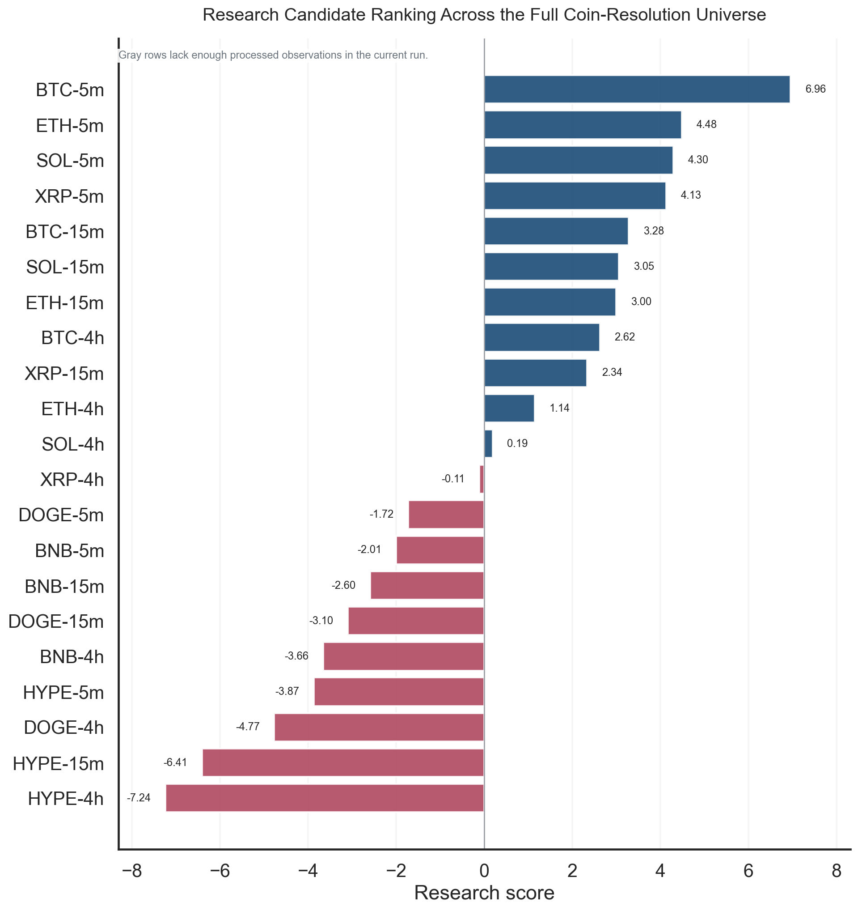
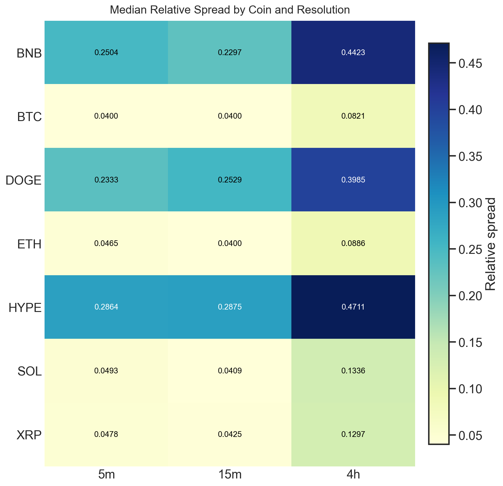
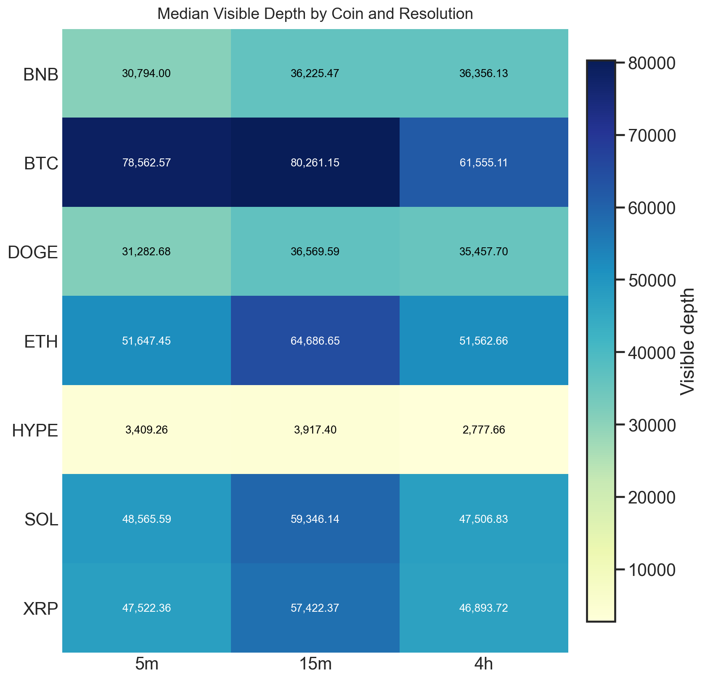
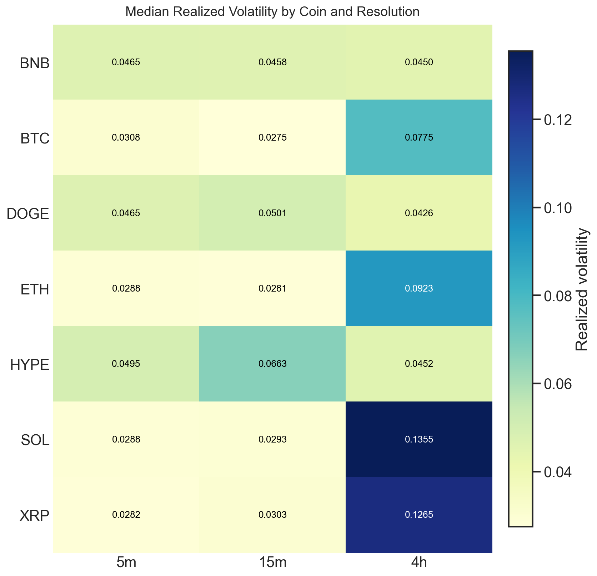
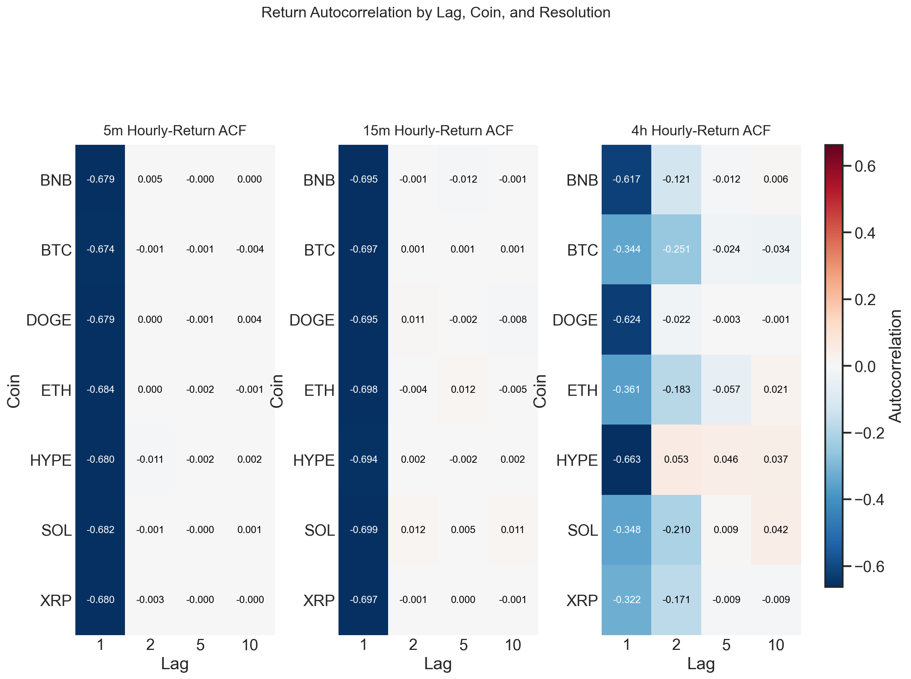
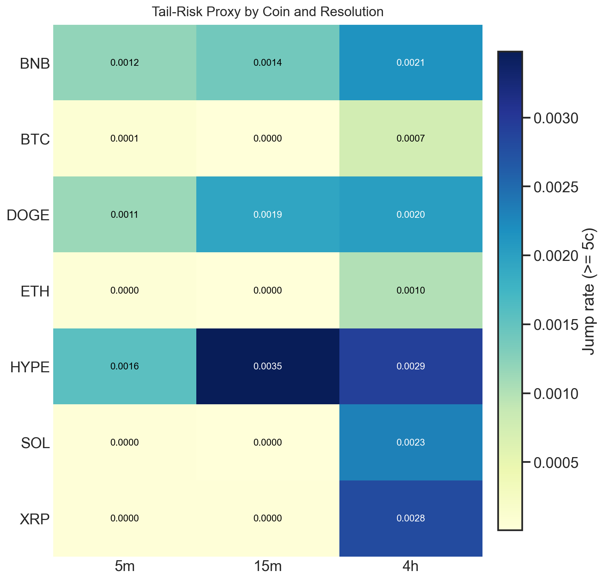
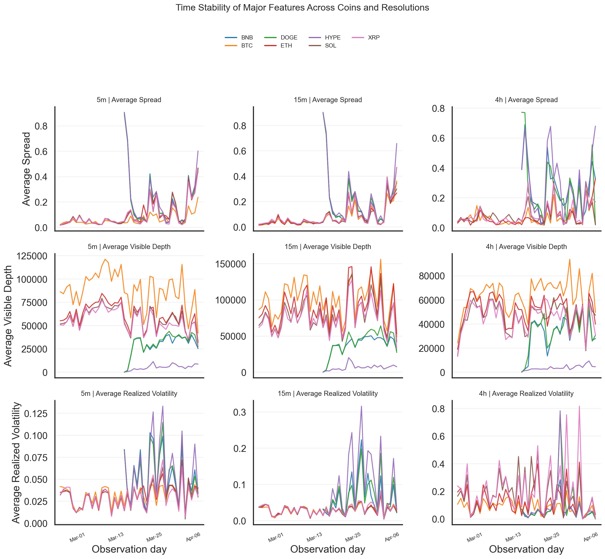

# Polymarket Crypto Up/Down Cross-Resolution EDA

## 1. Executive Summary
This report evaluates the cross-coin and cross-resolution research environment for Polymarket crypto up/down contracts using shared book and price-change coverage from `2026-02-21T16` through `2026-04-05T06`. The dataset spans 1022 aligned hourly batches, 3,922,991,396 raw rows, and 34.24 GB of parquet.
The strongest current research sandbox is BTC 5m with a research score of 6.96, while the weakest segment is HYPE 4h at -7.24. That spread is large enough to reject the idea that the universe is one interchangeable pool.
At the aggregate level, 5m is the strongest resolution regime and BTC is the strongest coin regime, both driven by tighter depth-adjusted execution conditions rather than raw activity alone. The practical implication is to start research in liquid short-horizon buckets and then test portability outward.

## 2. Dataset and Analytical Scope
Coverage matching is effectively complete across the three raw sources. The broadest observed bucket is SOL 5m with 11,531 distinct markets, while the sparsest bucket is DOGE 4h with 3,730 snapshots. That difference matters because the statistical reliability of any later alpha study is partly a function of how much market diversity and quote history sits behind the estimate.

**What we measure.**
We first establish the raw analytical surface: aligned source-file coverage, batch matching quality, and the observed breadth of coin x resolution buckets that survive the shared-hour construction.

**What we find.**
Coverage is effectively complete across the three raw sources, and the observed market breadth is highly uneven. Short-horizon buckets contribute the broadest test bed, while the thinnest long-horizon buckets carry much less statistical support.

**Why it matters.**
Any portability conclusion is only as strong as the market coverage behind it. A bucket with broad market history can support transfer claims; a sparse bucket can only support conditional or local claims.

| source | file_count | distinct_hours | total_rows | total_size_gb | first_hour | last_hour | extra_files_beyond_hours |
| --- | --- | --- | --- | --- | --- | --- | --- |
| book_snapshot | 1,022 | 1,022 | 103,192,699 | 5.93 | 2026-02-21T16 | 2026-04-05T06 | 0 |
| mapping | 1,022 | 1,022 | 1,408,452 | 0.28 | 2026-02-21T16 | 2026-04-05T06 | 0 |
| price_change | 1,023 | 1,022 | 3,818,390,245 | 28.04 | 2026-02-21T16 | 2026-04-05T06 | 1 |

| source | hours_processed | files_processed | raw_rows | matched_rows | output_rows | unmatched_rows | average_match_rate |
| --- | --- | --- | --- | --- | --- | --- | --- |
| book_snapshot | 1,022 | 1,022 | 103,192,699 | 103,192,699 | 963,674 | 0 | 1.0000 |
| mapping | 1,022 | 1,022 | 1,408,452 | 1,408,452 | 1,408,452 | 0 | 1.0000 |
| price_change | 1,022 | 1,023 | 3,818,390,245 | 3,818,390,245 | 2,715,066 | 0 | 1.0000 |

## 3. Coverage and Transferability

**What we measure.**
We rank each coin-resolution bucket on one common research score built from coverage breadth, visible depth, relative spread, quote freshness, volatility stability, tail risk, spread stability, and friction-to-move.

**What we find.**
The transferability picture is uneven. The strongest current sandbox is BTC 5m, while the weakest is HYPE 4h. The cheapest friction-to-move profile is ETH 4h at 0.9601, whereas the richest friction burden is HYPE 4h at 10.4174.

**Why it matters.**
This ranking is not cosmetic. It tells us where a new alpha is most likely to survive its first contact with execution costs and sampling uncertainty. High-ranked buckets are appropriate starting points; low-ranked buckets are stress tests, not defaults.

Top research candidates:

| coin | resolution | research_score | relative_spread_median | total_visible_depth_median | realized_volatility_median | spread_to_vol_ratio |
| --- | --- | --- | --- | --- | --- | --- |
| BTC | 5m | 6.9563 | 0.0400 | 78,562.5739 | 0.0308 | 1.3000 |
| ETH | 5m | 4.4838 | 0.0465 | 51,647.4513 | 0.0288 | 1.6153 |
| SOL | 5m | 4.2951 | 0.0493 | 48,565.5943 | 0.0288 | 1.7126 |
| XRP | 5m | 4.1304 | 0.0478 | 47,522.3630 | 0.0282 | 1.6960 |
| BTC | 15m | 3.2794 | 0.0400 | 80,261.1451 | 0.0275 | 1.4553 |
| SOL | 15m | 3.0547 | 0.0409 | 59,346.1364 | 0.0293 | 1.3994 |
| ETH | 15m | 2.9971 | 0.0400 | 64,686.6459 | 0.0281 | 1.4237 |
| BTC | 4h | 2.6244 | 0.0821 | 61,555.1134 | 0.0775 | 1.0599 |

Weakest research candidates:

| coin | resolution | research_score | relative_spread_median | stale_quote_frequency_median | realized_volatility_median | spread_to_vol_ratio |
| --- | --- | --- | --- | --- | --- | --- |
| BNB | 5m | -2.0063 | 0.2504 | 0.8252 | 0.0465 | 5.3884 |
| BNB | 15m | -2.5959 | 0.2297 | 0.8250 | 0.0458 | 5.0167 |
| DOGE | 15m | -3.1036 | 0.2529 | 0.8095 | 0.0501 | 5.0465 |
| BNB | 4h | -3.6591 | 0.4423 | 0.7929 | 0.0450 | 9.8207 |
| HYPE | 5m | -3.8708 | 0.2864 | 0.8205 | 0.0495 | 5.7824 |
| DOGE | 4h | -4.7706 | 0.3985 | 0.8417 | 0.0426 | 9.3458 |
| HYPE | 15m | -6.4131 | 0.2875 | 0.8233 | 0.0663 | 4.3363 |
| HYPE | 4h | -7.2397 | 0.4711 | 0.8358 | 0.0452 | 10.4174 |

## 4. Microstructure Conditions

**What we measure.**
We summarize each bucket's trading environment using median relative spread, visible depth, stale-quote frequency, and quote-update intensity. These are the core inputs that determine whether paper alpha can plausibly be traded.

**What we find.**
The tightest observed spread regime is BTC 15m at 0.0400, while the deepest visible book is BTC 15m at 80,261.15 units of displayed depth.

**Why it matters.**
Microstructure quality is the bridge between statistical edge and executable edge. A bucket can look attractive in theory, but if it is thin, wide, or stale, the strategy will pay away its signal in friction.

| coin | resolution | relative_spread_median | total_visible_depth_median | stale_quote_frequency_median | quote_update_intensity_median |
| --- | --- | --- | --- | --- | --- |
| BNB | 15m | 0.2297 | 36,225.4664 | 0.8250 | 1.4314 |
| BNB | 4h | 0.4423 | 36,356.1333 | 0.7929 | 1.1478 |
| BNB | 5m | 0.2504 | 30,794.0012 | 0.8252 | 2.2653 |
| BTC | 15m | 0.0400 | 80,261.1451 | 0.9000 | 21.4733 |
| BTC | 4h | 0.0821 | 61,555.1134 | 0.6310 | 1.8976 |
| BTC | 5m | 0.0400 | 78,562.5739 | 0.9069 | 35.1340 |
| DOGE | 15m | 0.2529 | 36,569.5886 | 0.8095 | 1.4422 |
| DOGE | 4h | 0.3985 | 35,457.7009 | 0.8417 | 0.9942 |
| DOGE | 5m | 0.2333 | 31,282.6842 | 0.8159 | 2.4753 |
| ETH | 15m | 0.0400 | 64,686.6459 | 0.8389 | 11.2615 |
| ETH | 4h | 0.0886 | 51,562.6583 | 0.5931 | 1.2412 |
| ETH | 5m | 0.0465 | 51,647.4513 | 0.8299 | 13.6769 |
| HYPE | 15m | 0.2875 | 3,917.4026 | 0.8233 | 1.1725 |
| HYPE | 4h | 0.4711 | 2,777.6563 | 0.8358 | 1.2497 |
| HYPE | 5m | 0.2864 | 3,409.2600 | 0.8205 | 2.6263 |
| SOL | 15m | 0.0409 | 59,346.1364 | 0.8102 | 7.8316 |
| SOL | 4h | 0.1336 | 47,506.8333 | 0.5572 | 1.1052 |
| SOL | 5m | 0.0493 | 48,565.5943 | 0.8085 | 9.8577 |
| XRP | 15m | 0.0425 | 57,422.3660 | 0.7949 | 6.8228 |
| XRP | 4h | 0.1297 | 46,893.7247 | 0.5269 | 1.1759 |
| XRP | 5m | 0.0478 | 47,522.3630 | 0.8069 | 8.0839 |

## 5. Return Dynamics and Stability

**What we measure.**
We measure realized volatility, jump intensity, hourly-return autocorrelation, and day-to-day stability in spreads, depth, volatility, and tail risk. Together these describe how noisy and how stable each research environment is.

**What we find.**
The calmest midpoint regime is BTC 15m at 0.0275, while the noisiest is SOL 4h at 0.1355. The heaviest jump regime is HYPE 15m at 0.0035.

**Why it matters.**
A useful research market is not just liquid; it is also behaviorally stable enough that a discovered pattern can be retested out of sample without the environment changing shape underneath it.

| coin | resolution | realized_volatility_median | jump_rate_large_median | change_intensity_median | acf_midpoint_lag_1 |
| --- | --- | --- | --- | --- | --- |
| BNB | 15m | 0.0458 | 0.0014 | 70.8275 | -0.6950 |
| BNB | 4h | 0.0450 | 0.0021 | 108.8719 | -0.6169 |
| BNB | 5m | 0.0465 | 0.0012 | 611.7615 | -0.6790 |
| BTC | 15m | 0.0275 | 0.0000 | 136.8347 | -0.6967 |
| BTC | 4h | 0.0775 | 0.0007 | 46.2578 | -0.3442 |
| BTC | 5m | 0.0308 | 0.0001 | 115.1616 | -0.6739 |
| DOGE | 15m | 0.0501 | 0.0019 | 94.7412 | -0.6952 |
| DOGE | 4h | 0.0426 | 0.0020 | 26.3100 | -0.6238 |
| DOGE | 5m | 0.0465 | 0.0011 | 595.7032 | -0.6786 |
| ETH | 15m | 0.0281 | 0.0000 | 160.6167 | -0.6984 |
| ETH | 4h | 0.0923 | 0.0010 | 39.2188 | -0.3606 |
| ETH | 5m | 0.0288 | 0.0000 | 182.8276 | -0.6835 |
| HYPE | 15m | 0.0663 | 0.0035 | 167.0434 | -0.6937 |
| HYPE | 4h | 0.0452 | 0.0029 | 70.1824 | -0.6627 |
| HYPE | 5m | 0.0495 | 0.0016 | 245.4529 | -0.6799 |
| SOL | 15m | 0.0293 | 0.0000 | 132.4845 | -0.6994 |
| SOL | 4h | 0.1355 | 0.0023 | 44.3832 | -0.3482 |
| SOL | 5m | 0.0288 | 0.0000 | 163.9311 | -0.6825 |
| XRP | 15m | 0.0303 | 0.0000 | 113.7883 | -0.6969 |
| XRP | 4h | 0.1265 | 0.0028 | 46.1686 | -0.3224 |
| XRP | 5m | 0.0282 | 0.0000 | 203.0712 | -0.6804 |

| coin | resolution | spread_cv | depth_cv | volatility_cv | tail_risk_cv |
| --- | --- | --- | --- | --- | --- |
| BNB | 15m | 1.0014 | 0.3636 | 0.8489 | 0.8853 |
| BNB | 4h | 0.6256 | 0.4703 | 0.9639 | 0.9401 |
| BNB | 5m | 0.9978 | 0.3620 | 0.5612 | 1.1038 |
| BTC | 15m | 1.0294 | 0.2527 | 0.4721 | 0.8787 |
| BTC | 4h | 0.8954 | 0.2326 | 0.5905 | 0.6919 |
| BTC | 5m | 0.7388 | 0.2187 | 0.3912 | 0.5888 |
| DOGE | 15m | 0.9849 | 0.4094 | 0.7610 | 0.6791 |
| DOGE | 4h | 0.7984 | 0.4465 | 1.6001 | 1.6174 |
| DOGE | 5m | 1.0133 | 0.3683 | 0.5859 | 1.1761 |
| ETH | 15m | 1.0469 | 0.2986 | 0.4597 | 0.8113 |
| ETH | 4h | 0.9867 | 0.2495 | 0.7838 | 1.2152 |
| ETH | 5m | 1.0016 | 0.2128 | 0.4200 | 0.9401 |
| HYPE | 15m | 0.9533 | 0.6234 | 0.8583 | 0.9357 |
| HYPE | 4h | 0.7006 | 0.5267 | 1.7902 | 1.1606 |
| HYPE | 5m | 0.9767 | 0.5295 | 0.6244 | 0.9375 |
| SOL | 15m | 1.0370 | 0.2954 | 0.4676 | 0.8319 |
| SOL | 4h | 0.7438 | 0.2469 | 0.7507 | 1.0206 |
| SOL | 5m | 1.0311 | 0.2065 | 0.4456 | 0.9385 |
| XRP | 15m | 1.1359 | 0.2811 | 0.4861 | 0.8502 |
| XRP | 4h | 0.8018 | 0.2632 | 0.8994 | 1.1370 |
| XRP | 5m | 1.0532 | 0.2094 | 0.4729 | 0.8235 |

## 6. Research Implications
The evidence supports a disciplined research sequence. First, develop and validate ideas in BTC 5m and the rest of the top-ranked short-horizon buckets, because they offer the cleanest combination of breadth, depth, and friction control. Second, treat 4h buckets as conditional transfer targets rather than default extensions, because their average market quality is materially weaker. Third, keep sparse buckets visible in the analysis rather than filtering them away: the absence of stable structure is itself an important finding.

Sparse combinations flagged for caution:

| note |
| --- |
| None in this run |
