# Microstructure and Mispricing in Polymarket's Bitcoin Up-Down Contracts

## 1. Introduction

Polymarket runs short-horizon Bitcoin "Up or Down" contracts that resolve every
5 or 15 minutes. Each contract pays $1 if BTC's price at the end of a fixed
window is at or above its price at the start, and $0 otherwise. This binary
payoff makes the contract price directly interpretable as the market's
implied probability that BTC will finish higher than where it started.

Short-horizon prediction markets are interesting because, unlike longer-dated
markets, they expose the market's frictions: there isn't enough time for
arbitrage to fully equilibrate prices, liquidity providers face acute
adverse-selection risk near expiry, and small differences in oracle behaviour
can determine whether a contract pays out at all.

This report investigates how these contracts behave near resolution, where
the most interesting mispricing happens, and presents two trading strategies
that try to exploit the inefficiencies we find. Section 2 describes the
contract structure and our data. Section 3 documents three microstructure
findings about how these markets can introduce unexpected deviations. 
Sections 4 and 5 present order-book and time-based trading strategies that 
exploit those findings. Section 6 examines how the strategies interact 
with broader cryptocurrency volatility regimes. 
Section 7 discusses what worked, what didn't, and what we'd do next.

### 1.1 Why these contracts are worth studying

BTC up-down contracts are a useful setting for studying short-horizon prediction
markets because their prices are easy to interpret and their resolution is
frequent. Unlike longer-dated prediction markets, these contracts expire within
minutes, so any inefficiency is more likely to reflect market frictions such as
slow updating, order-book imbalance, or resolution mechanics rather than broad
uncertainty about future fundamentals.

### 1.2 What this report tries to answer

This report asks three simple questions. First, do Polymarket prices behave like
well-calibrated probabilities? Second, do these markets display repeatable
mispricing near expiry? Third, if such inefficiencies exist, can they be used
to motivate consistent and practical trading strategies?

## 2. The Market

### 2.1 How a contract works

A Polymarket BTC up-down 5-minute contract has the slug format
`btc-updown-5m-<unix_timestamp>`. The unix timestamp marks the start of the
"live" 5-minute window. At that moment, Polymarket records BTC's spot price
from Chainlink as the strike. Five minutes later, it records BTC again. If
the second price is greater than or equal to the first, "Up" pays $1; otherwise
"Down" pays $1.

There are two tradeable token sides for every market. By no-arbitrage, the
prices for Up and Down should sum to approximately 1.0 — anything else would
be a free-money arbitrage. We verify this empirically and use it as a
liquidity sanity check.

Trading happens on Polymarket's central limit order book (CLOB). Polymarket
itself does not set prices; they emerge from limit orders placed by users.
Order matching is off-chain, settlement is on-chain via the Polygon network.

### 2.2 The three-phase lifecycle

A surprising fact about these contracts is that they trade for much longer
than their nominal 5-minute window. Each contract has a clear three-phase
lifecycle:

[INSERT LIFECYCLE PLOT HERE]

- **Pre-market** (~15-30 minutes before live start): The contract is listed
  and tradeable, but the strike price hasn't been set yet. Midprices sit at
  approximately 0.50, since traders have nothing concrete to anchor on
  besides BTC drift expectations.
- **Live** (the 5 or 15 minutes between start and end): The contract is
  actively determined by BTC's price movement. Midprices diverge from 0.50
  as BTC moves above or below the strike.
- **Post-resolution** (a few minutes after live-end): The outcome is
  effectively known, and prices converge toward 0 or 1, eventually ending
  in a "book wipe" as remaining orders are cancelled.

This phase structure matters because it determines what kind of analysis is
meaningful at each point. Pre-market prices can't be tested for fair value
(no strike). Live prices reflect real information aggregation. Post-resolution
prices reflect mechanical convergence rather than belief updating.

### 2.3 Resolution via Chainlink

Polymarket resolves these contracts using the Chainlink BTC/USD Data Stream,
a low-latency price oracle that aggregates spot prices from multiple
centralised exchanges. We do not have direct access to Chainlink Data Streams
historical reports, so we use Binance and Coinbase prices as proxies for the
underlying BTC spot price. We discuss the limitations of this in Section 3.4.

### 2.4 Data

We use:
- Polymarket order book data (~1.2 billion events from 21st Feb 2026 
  to 24th March 2026, filtered to BTC 5-minute and 15-minute markets). These
  are downloaded from PMXT archives https://archive.pmxt.dev/)
- Polymarket market metadata from scraping the Gamma API 
  (slug, condition ID, token IDs, strike, settlement timestamps)
- BTC spot prices from Binance (BTC/USDT) and Coinbase (BTC/USD) via ccxt
  https://github.com/ccxt/ccxt

## 3. Microstructure Findings

This section presents three practical observations from the data. For each one,
we describe how we measure it, what we observe, and why it matters for trading.

### 3.1 Finding 1: Terminal convergence lag

**What we measure.**  
We examine how quickly market prices converge toward their final realized
outcome near and after the end of the live window.

**What we find.**  
[Insert your numbers here.]

**Why it matters.**  
This suggests that some contracts do not fully incorporate the final outcome
immediately at live-end. Instead, prices can remain stale briefly before
snapping toward 0 or 1. This creates the basic intuition for the time-based
strategy in Section 5.

### 3.2 Finding 2: Last-second leader switches

**What we measure.**  
We define a switcher as a market where the side leading shortly before expiry
 is not the final winner.

**What we find.**  
We find that last-second switches occur in a non-trivial minority of markets.
In our BTC sample, the switch rate is meaningfully above zero, and in several
cases the direction of the reversal appears to follow the broader drift of BTC
on that day.

**Why it matters.**  
This suggests that prices near expiry are not always fully settled beliefs.
Instead, they may still lag the underlying market, especially in fast-moving
conditions.

### 3.3 Finding 3: Cross-exchange divergence at resolution

**What we measure.**  
Because we do not have historical Chainlink reports, we compare Binance and
Coinbase spot prices around the resolution boundary as proxies for the
underlying BTC move.

**What we find.**  
[Insert your comparison result here.]

**Why it matters.**  
This shows that some apparent mispricings may reflect genuine source
differences near the boundary rather than purely slow reaction by Polymarket
traders. This is an important source of residual risk in any expiry-based
strategy.

### 3.4 What these findings imply

Taken together, these findings suggest that short-horizon BTC up-down markets
are informative but not frictionless. Prices can lag near expiry, the apparent
winner can switch at the end, and source differences around the resolution
boundary can create tail risk. These effects motivate the order-book and
time-based strategies in the next sections.

## 4. Regime Conditioning

TBA

## 5. Strategy 1: Mid-price Momentum

TBA

## 6. Strategy 2: Relative Order Book Strength

The relative book strength strategy evaluates whether cross-sectional differences in order-book quality
between the two contract sides (Up and Down) can be used to identify the
eventual winning side. The central hypothesis is that persistent relative
microstructure advantages contain information that is not fully captured by a
single contemporaneous snapshot.

### 6.1 Economic Intuition

Because the two sides represent mutually exclusive outcomes of the same binary
event, their prices are jointly constrained by the payout structure. As a
result, the informative object is the *relative* state of the two books at a
given event time rather than either side in isolation. If one side repeatedly
exhibits tighter spreads, greater effective depth, and more favorable pressure,
this pattern may reflect faster information incorporation and, consequently,
higher probability of final correctness.

Event-level order-book states are, however, noisy. Quote revisions may be
transient, resting liquidity can be episodic, and event-time sampling is
irregular. The cumulative variants are therefore designed to suppress
high-frequency noise and extract persistent directional structure.

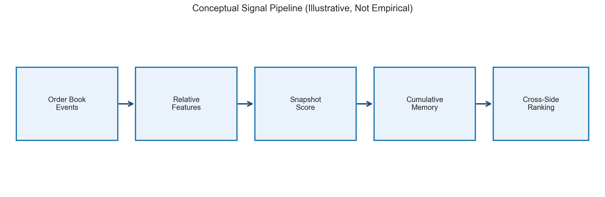

*Figure 6.1. Conceptual signal pipeline from raw orderbook events to cross-side ranking (illustrative schematic).* 

### 6.2 Signal Design and Notation

For a market, one of the two sides, and an event time, let the best ask price
be the top ask quote, the best bid price be the top bid quote, and the resting
ask and bid quantities at the top of book be the corresponding queue sizes.
We define the top-of-book spread in basis points as

$$
spread_{i,t}=10^4\cdot\frac{a^{(1)}_{i,t}-b^{(1)}_{i,t}}{\tfrac{1}{2}(a^{(1)}_{i,t}+b^{(1)}_{i,t})}
$$

and the top-of-book depth as

$$
depth_{i,t}=q^{ask}_{i,t}+q^{bid}_{i,t}
$$

- spread: top-of-book spread in basis points
- depth: sum of the resting ask and bid quantities at the top of book
- pressure: resting ask quantity minus resting bid quantity at the top of book
- imbalance: absolute value of pressure

To make features comparable across markets and timestamps, each raw feature is
converted into a within-market relative score across the two sides. Let the
side set contain Up and Down. For a generic feature x, define:

$$
r_{x,i,t}=\frac{x_{i,t}-\bar{x}_{m,t}}{\max_{j\in I_m}x_{j,t}-\min_{j\in I_m}x_{j,t}}
$$

where the numerator uses the cross-side mean at the same market-time point, and
the denominator is the cross-side range at that same market-time point.

Since lower spread implies better execution quality, we invert spread:

$$
r_{s,i,t}^{inv}=\frac{\bar{s}_{m,t}-s_{i,t}}{\max_{j\in I_m}s_{j,t}-\min_{j\in I_m}s_{j,t}}
$$

The snapshot strength score is defined as:

$$
S_{i,t}^{snp}=0.45\,r_{p,i,t}+0.35\,r_{s,i,t}^{inv}+0.15\,r_{d,i,t}+0.05\,r_{b,i,t}
$$

where pressure, depth, and imbalance denote the respective feature groups.

Three ranking rules are evaluated:

- Snapshot: rank by the snapshot strength score.
- Cumulative sum:

$$
S_{i,t}^{sum}=\sum_{\tau<t}S_{i,\tau}^{snp}
$$

- Exponentially weighted memory:

$$
S_{i,t}^{ewm}=\alpha S_{i,t-1}^{snp}+(1-\alpha)S_{i,t-1}^{ewm}
$$

$$
\alpha=0.2
$$

All cumulative diagnostics are computed in strict causal mode, so each score at
time t depends only on information available before the current event.

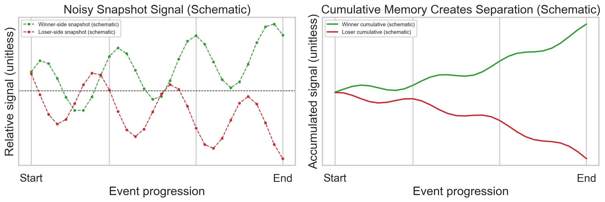

*Figure 6.2. Schematic intuition for why cumulative memory suppresses noise and improves side separation.*

### 6.3 Backtesting Methodology and Data Integrity Controls

**Core Principle:** Performance should only be credited to information that would have been available at the moment the trade decision was made.

#### 6.3.1 Data Joining

Prepared PMXT features, market metadata, and resolution records are merged using the following canonical identifiers:
- Market ID
- Token ID  
- Event timestamp

This is critical because the strategy is cross-sectional by construction:
- Up and Down sides must be compared at the same market-time point
- Resolution labels must remain outside the feature set until evaluation time
- Inexact joins can artificially inflate signal strength

#### 6.3.2 Feature Construction and Causal Ordering

All cumulative metrics are computed in event time with strict causal discipline:
- Rows are ordered by timestamp within each market-token path *before* any cumulative transform
- Each score at time $t$ uses only data up to $t$
- The cross-sectional ranking at a market-time point uses only the book state observed at that point

#### 6.3.3 Data Cleanliness and Validation

Before scoring, data is handled conservatively:
- Price, spread, and depth fields are coerced to numeric types
- Invalid parses are treated as nulls
- Zero cross-side ranges are stabilized to avoid division-by-zero artifacts
- Post-resolution rows are trimmed before strategy evaluation
- Required-column checks fail fast when expected microstructure inputs are missing, preventing silent degradation

#### 6.3.4 Execution Simulation and Cost Accounting

Execution is treated as part of the test rather than as a cosmetic overlay. The execution engine models realistic market conditions at the moment a signal triggers:

**Order Placement and Fill Logic:**
- Orders are sized according to entry rules (e.g., fixed fraction of current book depth)
- Fill probability is estimated from order book depth: larger orders against tighter books face higher rejection risk
- Slippage is calculated from the observed spread and aggressive order impact at the time of signal
- Fill/reject outcomes are recorded explicitly, distinguishing between partial fills and outright rejections

**Cost Structure:**
- Explicit fees and commissions applied per trade based on position size
- Risk limits enforce maximum position size and per-market exposure limits
- Sizing controls scale position down if liquidity constraints bind
- Gross PnL, fees, and net PnL are tracked separately to isolate the cost of execution

**Market-Specific Adjustments:**
- Entry points adapt to market conditions: looser books allow larger orders; tight books trigger smaller positions
- Latency assumptions account for time between signal generation and order submission, allowing prices to drift
- Post-fill management includes hedging constraints and liquidity considerations for exit

This separation is important because a directionally correct signal can still produce weak realized returns once transaction costs and execution quality are included. Tracking these components separately makes it clear whether weakness stems from poor signal timing, suboptimal sizing, or simply unavoidable transaction costs.

#### 6.3.5 Sampling, Splitting, and Reproducibility

The sampling and split protocol is fixed to ensure stability across experiments:
- All run configurations are written as artifacts
- Split metadata is recorded for replay
- The exact experiment can be reproduced with identical input ordering and configuration

This enables consistent comparisons across different backtesting runs and experimental variations.

#### 6.3.6 Leakage Detection and Validation

The workflow includes explicit leakage checks at multiple levels:
- Early-market signals are tested for invariance under perturbations to future-market rows
- Recalibration thresholds are verified at their expected update cadence
- Repeated runs on identically ordered input must produce identical outputs

These checks do not eliminate model risk, but they materially reduce the chance that the reported edge is an artifact of look-ahead contamination.

### 6.4 Full-Market Reliability, Confidence, and Stability Diagnostics

On the full-market run, both cumulative variants outperform the snapshot
baseline, with cumulative-sum as the top specification.

| Method | Timestamp Accuracy | Final Market Accuracy | Markets |
|---|---:|---:|---:|
| cumulative_sum_score | 0.549 | 0.665 | 5,076 |
| cumulative_ewm_score | 0.543 | 0.583 | 5,076 |
| snapshot_score | 0.509 | 0.462 | 5,076 |

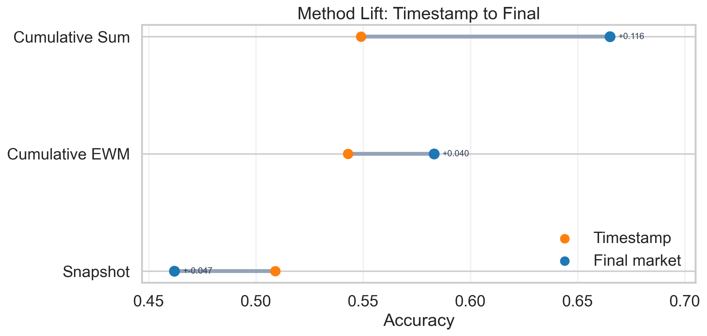

*Figure 6.3. Method-level lift from timestamp accuracy to final-market accuracy.*

Two implications follow immediately. First, temporal aggregation provides a
substantial gain over point-in-time ranking. Second, the strongest gains are
observed in the final-market metric, indicating materially better terminal
discrimination.

Progress-quartile analysis (Q1 early to Q4 late) further supports this result:

| Method | Q1 (early) | Q2 | Q3 | Q4 (late) |
|---|---:|---:|---:|---:|
| cumulative_sum_score | 0.517 | 0.539 | 0.557 | 0.582 |
| cumulative_ewm_score | 0.511 | 0.528 | 0.546 | 0.586 |
| snapshot_score | 0.500 | 0.502 | 0.504 | 0.529 |

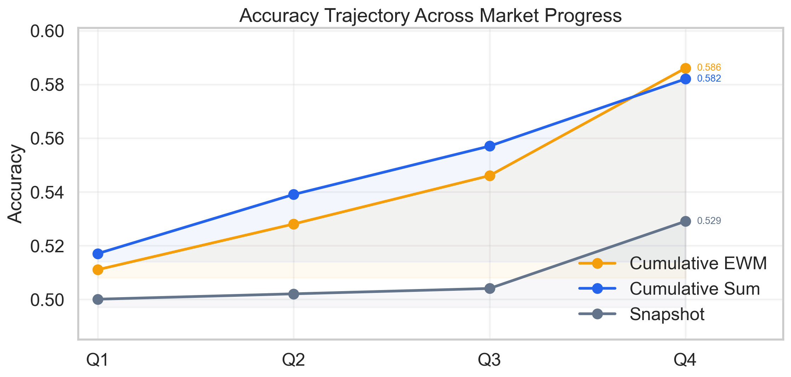

*Figure 6.4. Accuracy trajectories over market progress quartiles for snapshot and cumulative methods.*

The monotone increase in cumulative-method accuracy across quartiles is
consistent with a signal that strengthens as information accumulates and
transient microstructure noise is averaged out.

Confidence and stability diagnostics were computed on the same run using Wilson
95% intervals. The results are:

| Method | Final Accuracy | Final 95% CI | Timestamp Accuracy | Timestamp 95% CI |
|---|---:|---:|---:|---:|
| cumulative_sum_score | 0.665 | [0.652, 0.678] | 0.549 | [0.549, 0.549] |
| cumulative_ewm_score | 0.583 | [0.570, 0.597] | 0.543 | [0.542, 0.543] |
| snapshot_score | 0.462 | [0.449, 0.476] | 0.509 | [0.509, 0.509] |

The interval structure is informative. Timestamp intervals are narrow due to
the very large sample size, while final-market intervals are wider but remain
well separated across methods, preserving the performance ranking.

Weekly concentration diagnostics for `cumulative_sum_score` are:

| Statistic | Value |
|---|---:|
| Minimum weekly accuracy | 0.542 |
| Maximum weekly accuracy | 0.569 |
| Weekly standard deviation | 0.010 |

Taken together, these weekly results indicate that the edge is not concentrated
in a single outlier week. Performance remains above 0.50 in all observed weeks,
with moderate cross-week dispersion.

Overall, the classification evidence is strong: cumulative-sum ranks the
eventual winner more reliably than alternatives. But directional quality alone
is not sufficient for deployment. Realized PnL depends on execution state,
entry timing, and liquidity conditions, so the next step is to test which gate
design best translates signal quality into tradable outcomes.

### 6.5 Gate Design and Diagnostics

This section asks a narrower question: given that the signal is informative,
which execution gates actually help once we rank by Sharpe and enforce a drawdown cap?

We reran the gate ablation on a random 500-market sample from the first 3,000
BTC 5-minute markets. Candidates were ranked by market-level log-return Sharpe,
with an adaptive max-drawdown limit of 23.06% derived from the train-split
distribution.

Before presenting the ablation, it is important to clarify why gates exist in
the first place. In this report, a gate is a deterministic acceptance rule that
must be satisfied before a ranked signal is allowed to generate a trade.
Conceptually, the ranking model answers a directional question (which side is
more likely to win), while the gate layer answers an execution question
(whether current market conditions are suitable for expressing that view).

The motivation for gate design is therefore not to replace the signal, but to
control *where* and *when* it is acted upon. In short-horizon binary markets,
many weak entries arise because execution state is poor: spreads are wide,
book shape is uneven, price is too close to the payoff ceiling, or time to
resolution is too short for robust handling. Gates are introduced to remove
those avoidable states.

Each gate has a distinct pre-test purpose:

1. Spread gate: avoid paying excessive instantaneous transaction cost and reduce
  entries during quote dislocation.
2. Score-threshold gate: require a minimum absolute signal strength so that
  weakly ranked states do not trigger trades.
3. Score-gap gate: require cross-side separation in ranking scores, reducing
  entries in ambiguous states where the two sides are nearly tied.
4. Price-cap gate: avoid buying at prices where upside is mechanically limited
  by the binary payoff bound.
5. Liquidity gate: enforce minimum local depth to reduce slippage sensitivity
  and unstable fills.
6. Ask-depth-5 cap gate: avoid heavily stacked ask ladders that can indicate
  adverse local pressure or poor short-horizon execution geometry.
7. Time gate: favor entries closer to resolution once the signal has matured,
  so the strategy acts after direction is clearer and the book has had time to
  separate.

From this perspective, gate testing is a model-selection problem over the
execution layer: which constraints improve realized outcomes, and which are
overly restrictive once the cumulative-sum ranking signal is already informative.

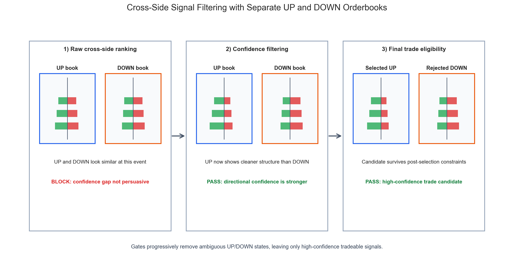

*Figure 6.5. Gates filter ambiguous UP-versus-DOWN states in stages, preserving only high-confidence trade candidates.*

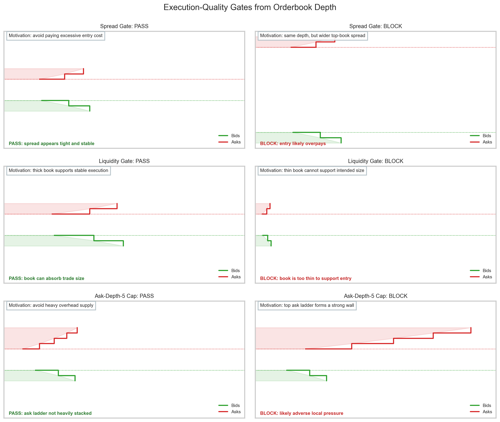

*Figure 6.6. Qualitative motivation for execution-quality gates: avoid costly, thin, and supply-heavy entry states.*

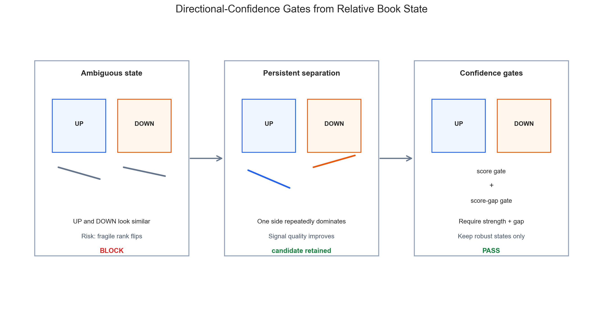

*Figure 6.7. Qualitative motivation for directional-confidence gates: reject ambiguous UP/DOWN states and keep only robust separation.*

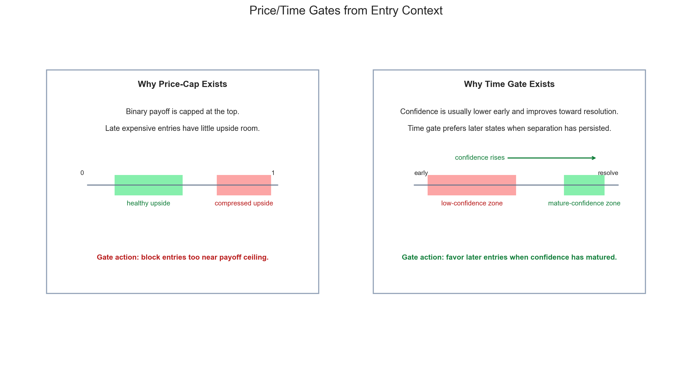

*Figure 6.8. Qualitative motivation for price and time gates: protect upside while allowing higher-confidence entries closer to resolution.*

The design uses 500 markets sampled uniformly without replacement from the
first 3,000 BTC 5-minute markets. This keeps the ablation tractable while still
covering a meaningful cross-section of market states, and it avoids mixing gate
effects with broad distribution shifts from very early versus late cohorts.

The interpretation is straightforward. Spread, price-cap, and liquidity gates
control immediate execution quality; score and score-gap gates control decision
confidence; time gate shifts the strategy toward later, more mature states
near resolution; and ask-depth-5 serves as a crowding filter for asymmetric
local book geometry.

Empirically, this framework is evaluated in a leave-one-gate-out design:
starting from the full gate set, one gate is removed at a time while all others
remain fixed. This isolates each gate's marginal contribution to trade count,
hit rate, market Sharpe, and max drawdown.

The updated ablation results are summarized below.

| Scenario | Trades | Win Rate | Market Sharpe | Max Drawdown |
|---|---:|---:|---:|---:|
| full_minus_spread_gate | 415 | 0.701 | 0.976 | 21.522% |
| cumulative_06_ask_depth_5_cap_gate | 410 | 0.751 | 0.530 | 20.193% |
| full_minus_time_gate | 410 | 0.751 | 0.530 | 20.193% |
| full_minus_score_gap_gate | 382 | 0.749 | -0.209 | 23.057% |
| cumulative_07_time_gate | 357 | 0.754 | -0.246 | 18.837% |
| full_gated | 357 | 0.754 | -0.246 | 18.837% |
| full_minus_score_gate | 357 | 0.754 | -0.246 | 18.837% |
| full_minus_liquidity_gate | 357 | 0.754 | -0.246 | 18.837% |
| full_minus_price_cap_gate | 401 | 0.781 | -0.293 | 19.351% |
| full_minus_ask_depth_5_cap_gate | 376 | 0.750 | -0.403 | 20.315% |

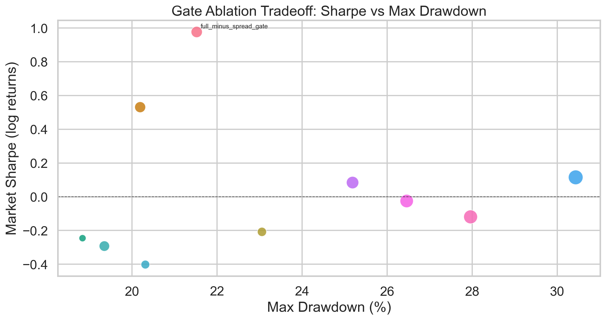

*Figure 6.9. Leave-one-gate-out tradeoff surface in Sharpe-drawdown space.*

The strongest result is that removing the spread gate is best under the new
objective. It lifts Sharpe to 0.976 while staying inside the drawdown cap.

The next-best outcomes are the cumulative variants that relax the ask-depth-5
or time gate. They are clearly better than the full-gated baseline, but they do
not beat spread-gate removal.

By contrast, price-cap and ask-depth-5 cap remain protective. Removing either
one weakens the objective, and removing ask-depth-5 is especially damaging.
Score and liquidity are effectively neutral in this run and can remain
secondary controls.

Accordingly, the recommended gating mechanism for the relative book strength strategy is to just disable the spread gate and keep all others in place.

### 6.6 Targeted HPO for Lower Drawdown

After fixing the gate structure from Section 6.5, the next step was to tune
thresholds within that fixed strategy design. The objective was not to change
signal logic, but to improve the Sharpe-drawdown tradeoff by searching for a
more stable operating region.

The initial targeted search space was:

| Parameter | Candidate Values |
|---|---|
| confidence_score_min | 0.80, 0.85, 0.90 |
| relative_book_score_quantile | 0.55, 0.65 |
| buy_price_max | 0.85, 0.88, 0.90 |
| min_liquidity | 0.05, 0.20 |
| ask_depth_5_max_filter | 800, 900 |
| max_time_to_resolution_secs | 180 |

This first targeted pass identified a clear cluster around confidence 0.80,
score-gap quantile 0.55, and ask-depth-5 cap 800 to 900. The top candidates
were:

| Scenario | Sharpe | Max Drawdown | Trades | Net PnL | Key Params |
|---|---:|---:|---:|---:|---|
| grid_010 | 0.551 | 46.788% | 2,219 | 60.977 | conf=0.80, gap=0.55, buy_cap=0.85, liq=0.20, ask5=800, t=180 |
| grid_029 | 0.551 | 46.788% | 2,219 | 60.977 | conf=0.80, gap=0.55, buy_cap=0.85, liq=0.05, ask5=800, t=180 |
| grid_030 | 0.544 | 46.106% | 2,284 | 59.460 | conf=0.80, gap=0.55, buy_cap=0.90, liq=0.20, ask5=800, t=180 |

Because these candidates were tightly grouped, we then ran a narrower local
refinement around `grid_010` with explicit drawdown awareness (hard objective
cap at 48% max drawdown). This second search focused on the nearby values
below:

| Parameter | Candidate Values |
|---|---|
| confidence_score_min | 0.78, 0.80, 0.82 |
| relative_book_score_quantile | 0.50, 0.55 |
| buy_price_max | 0.85, 0.88, 0.90, 0.92 |
| min_liquidity | 0.05 (fixed) |
| ask_depth_5_max_filter | 700, 800 |
| max_time_to_resolution_secs | 150, 180 |

The narrower pass improved both Sharpe and drawdown relative to the earlier
targeted sweep. The leading candidates were:

| Scenario | Sharpe | Max Drawdown | Trades | Net PnL | Key Params |
|---|---:|---:|---:|---:|---|
| grid_006 | 0.727 | 45.044% | 2,343 | 79.807 | conf=0.78, gap=0.55, buy_cap=0.92, liq=0.05, ask5=800, t=180 |
| grid_016 | 0.721 | 45.022% | 2,328 | 79.138 | conf=0.78, gap=0.55, buy_cap=0.90, liq=0.05, ask5=800, t=180 |
| grid_012 | 0.700 | 45.022% | 2,332 | 76.806 | conf=0.78, gap=0.50, buy_cap=0.90, liq=0.05, ask5=800, t=180 |

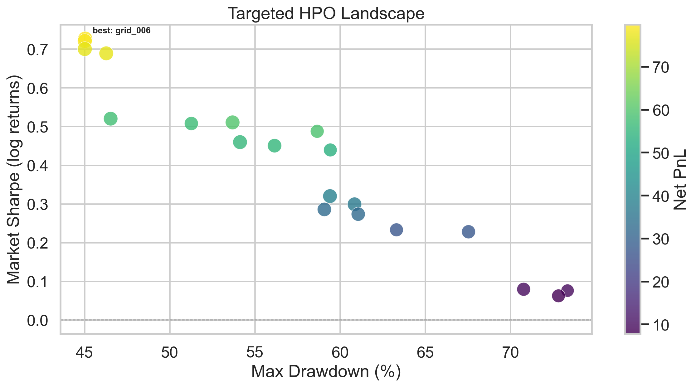

*Figure 6.10. Targeted HPO landscape over drawdown and Sharpe with net PnL intensity.*

Taken together, the refinement indicates that the best drawdown-adjusted
configuration in this neighborhood is centered around confidence 0.78,
ask-depth-5 cap 800, time cap 180 seconds, and buy-price caps at the upper end
of the tested range. We therefore selected `grid_006` for forward validation.

Using the refined HPO winner (`grid_006`) and the same static gate policy, we
ran strict forward validation on all markets beyond the first 3,000.

| Split | Scenario | Trades | Win Rate | Net PnL | Market Sharpe | Max Drawdown |
|---|---|---:|---:|---:|---:|---:|
| Train (3000) | grid_006 | 2,343 | 0.709 | 79.807 | 0.727 | 45.044% |
| OOS (2096) | grid_006 | 1,619 | 0.708 | 31.460 | 0.500 | 44.797% |

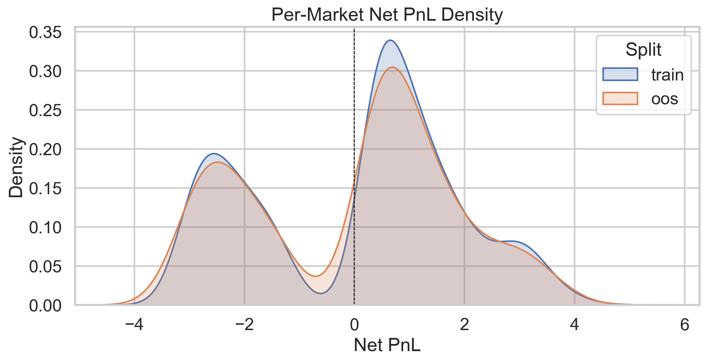

*Figure 6.11. Per-market net PnL density in train versus strict forward validation.*

The OOS results show good stability relative to train. Hit rate is effectively
unchanged (0.709 to 0.708), max drawdown is slightly lower out-of-sample
(45.0% to 44.8%), and market Sharpe remains positive at 0.500 on the holdout
segment. Net PnL stays positive after fees in both splits, indicating a
substantially stronger train-to-OOS transfer than earlier configurations.

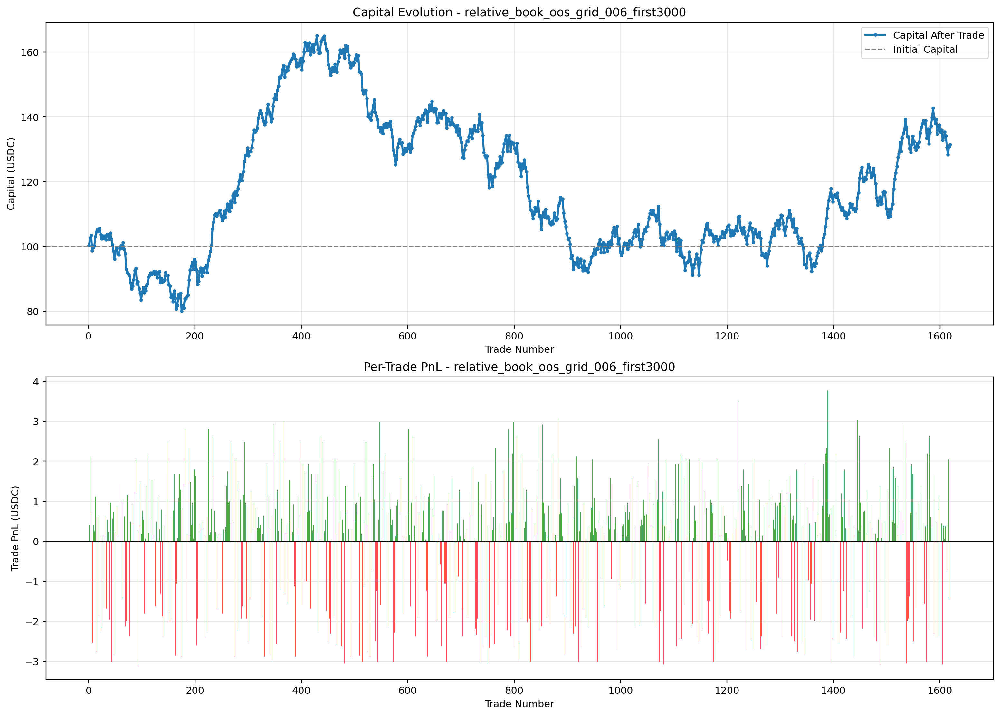

*Figure 6.12. OOS capital evolution and per-trade PnL.*

Viewed as a sequence rather than a single endpoint, the holdout path looks like alternating stretches of smooth progress and rougher patches where losses cluster before the curve recovers. The edge is still present, but its expression is uneven over time, hinting that the strategy is moving through different market environments rather than one stationary backdrop.

### 6.7 Volatility Regime Analysis

## 7. Discussion

What worked, what didn't, what we'd do next. Limitations: Chainlink proxy,
sample size, trading cost assumptions.