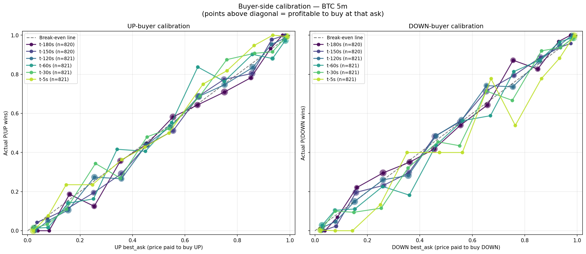
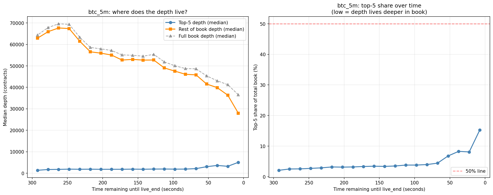

# Microstructure and Mispricing in Polymarket's Bitcoin Up-Down Contracts

## 1. Introduction

Polymarket runs short-horizon Bitcoin "Up or Down" contracts that resolve every
5 or 15 minutes. Each contract pays $1 if BTC's price at the end of a fixed
window is at or above its price at the start, and $0 otherwise. This binary
payoff makes the contract price directly interpretable as the market's
implied probability that BTC will finish higher than where it started.

Short-horizon prediction markets are interesting because, unlike longer-dated
markets, they expose the market's frictions: there isn't enough time for
arbitrage to fully equilibrate prices, liquidity providers face acute
adverse-selection risk near expiry, and small differences in oracle behaviour
can determine whether a contract pays out at all.

This report investigates how these contracts behave near resolution, where
the most interesting mispricing happens, and presents two trading strategies
that try to exploit the inefficiencies we find. Section 2 describes the
contract structure and our data. Section 3 documents three microstructure
findings about how these markets can introduce unexpected deviations.
Section 4 examines how the strategies interact with broader cryptocurrency
volatility regimes. Sections 5 and 6 present order-book and time-based
trading strategies that build on microstructure artifacts.
Section 7 discusses what worked, what didn't, and what we would do next.

### 1.1 Why these contracts are worth studying

BTC up-down contracts are a useful setting for studying short-horizon
prediction markets because their prices are easy to interpret and their
resolution is frequent. Unlike longer-dated prediction markets, these
contracts expire within minutes, so any inefficiency is more likely to reflect
market frictions — slow updating, order-book imbalance, or resolution
mechanics — rather than broad uncertainty about future fundamentals. The high
contract turnover (roughly 288 new BTC 5-minute markets per day) and short
resolution horizon make them close to an ideal laboratory for short-horizon
microstructure analysis.

### 1.2 What this report tries to answer

This report asks three simple questions. First, do Polymarket prices behave
like well-calibrated probabilities? Second, do these markets display
repeatable mispricing or microstructure inefficiency near expiry? Third, if
such inefficiencies exist, can they be used to motivate consistent and
practical trading strategies?

## 2. The Market

### 2.1 How a contract works

A Polymarket BTC up-down 5-minute contract has the slug format
`btc-updown-5m-<unix_timestamp>`. The unix timestamp marks the start of the
"live" 5-minute window. At that moment, Polymarket records BTC's spot price
from Chainlink as the strike. Five minutes later, it records BTC again. If
the second price is greater than or equal to the first, "Up" pays $1;
otherwise "Down" pays $1.

Each market has two tradeable sides — an Up side and a Down side — each with
its own order book. A trader buying a share of one side pays the best-ask
price on that side, in dollars per share. If that side wins the contract,
each share pays out $1; if it loses, each share pays $0. A share bought at
$0.80 therefore has two possible outcomes: a gross profit of $0.20 (if the
chosen side wins) or a loss of $0.80 (if it loses). The break-even win rate
for this trade is 80%, which is why the purchase price can be read directly
as the market's implied probability of that side winning. The two sides of a
market are jointly constrained by no-arbitrage: the Up and Down prices should
sum to approximately 1.0, and any deviation implies a free-money arbitrage
for a trader willing to hold until settlement.

This dual interpretation is part of why prediction markets are interesting to
study. The price is not just a trading price but also a direct readout of the
market's aggregated belief about an uncertain future event. Any systematic
gap between this implied probability and the actual frequency of outcomes is
both a tradeable mispricing and an economically meaningful failure of
information aggregation.

Trading happens on Polymarket's central limit order book (CLOB). Polymarket
itself does not set prices; they emerge from limit orders placed by users.
Order matching is off-chain, and final settlement is on-chain via the Polygon
network.

### 2.2 The three-phase lifecycle of a prediction market

A surprising fact about these contracts is that they trade for much longer
than their nominal 5-minute window. Each contract has a clear three-phase
lifecycle:

[INSERT LIFECYCLE PLOT HERE]

- **Pre-market** (~15-30 minutes before live start): The contract is listed
  and tradeable, but the strike price has not been set yet. Midprices sit at
  approximately 0.50, since traders have nothing concrete to anchor on
  besides BTC drift expectations.
- **Live** (the 5 or 15 minutes between start and end): The contract is
  actively determined by BTC's price movement. Midprices diverge from 0.50
  as BTC spot prices move above or below the strike.
- **Post-resolution** (a few minutes after live-end): The outcome is
  effectively known, and prices converge toward 0 or 1, eventually ending
  in a "book wipe" as remaining orders are cancelled.

This phase structure matters because it determines what kind of analysis is
meaningful at each point. Pre-market prices cannot be tested for fair value,
since there is no strike to be above or below. Live prices reflect real
information aggregation. Post-resolution prices reflect mechanical
convergence rather than belief updating, and the book itself becomes
unreliable as market makers pull their remaining quotes.

### 2.3 Resolution via Chainlink

To determine the winner of a contract, Polymarket needs a trusted source of
BTC spot prices at the exact start and end of the live window. It cannot rely
on its own midprice, because the contract's price reflects the market's
belief about BTC rather than BTC itself, and using a market's own price to
resolve it would create circular incentives.

Polymarket instead uses an **oracle**: an external data provider that reports
off-chain information to on-chain smart contracts in a trust-minimised way.
For BTC prices, Polymarket uses **Chainlink Data Streams**, a low-latency
price feed that aggregates real-time BTC/USD quotes from a basket of major
centralised exchanges (Coinbase, Binance, Kraken, and others) and produces a
cryptographically signed median price that can be verified on-chain. When a
contract's live window ends, Polymarket queries Chainlink for the BTC price
at that exact timestamp, compares it to the strike recorded at the start of
the window, and settles the contract accordingly.

Chainlink Data Streams is a paid commercial product and we do not have
access to its historical signed reports. This is not critical for our
analysis: the strategies we present later in this report do not use BTC spot
prices at all. They trade purely on features derived from Polymarket's own
order books and resolve against the actual outcomes recorded by the Gamma
API. The Chainlink mechanism matters mainly as background for understanding
how each contract is settled.

### 2.4 Data

We use two datasets for our microstructure analysis:

- **Polymarket order book data** from the PMXT archives
  (<https://archive.pmxt.dev/>), covering the period from 21 February 2026 to
  24 March 2026. The raw dataset contains roughly 1.2 billion order book
  events across all Polymarket markets as hourly parquet files. For this
  study we filter to the BTC "Up or Down" contracts at 5-minute and 15-minute
  durations and focus most of our attention on the 5-minute contracts, which
  are the primary setting for both trading strategies.
- **Polymarket market metadata and resolution outcomes** from the Gamma API
  (<https://gamma-api.polymarket.com>), including market slug, condition ID,
  CLOB token IDs (which identify the Up and Down sides), and the
  `outcomePrices` field that records the final resolution for each market.

### 2.5 Implementation

Our analysis pipeline is implemented in Python. We use `pandas` for tabular
manipulation and `pyarrow` for reading parquet files. The PMXT order book
data is delivered as hourly parquet files containing a raw event stream —
interleaved book snapshots and price-change deltas — with a JSON-encoded
payload column.

## 3. Microstructure Findings

This section presents three observations about BTC prediction markets from
the data. For each one, we describe how we measure it, what we observe, and
why it is worth paying attention to.

### 3.1 Finding 1: Post-resolution leader switches

**What we measure.**

A Polymarket contract trades continuously during its live window, so at any
moment we can identify the **leading side** as whichever of Up or Down has
the higher midprice at that moment. In an efficient market, the leader at
the moment trading stops should almost always match the final resolution —
otherwise the market was still wrong about the outcome with no time left to
correct itself.

We define a **switcher** as a market whose leader at the last valid
(non-wiped) event before `live_end` does not match the final resolution
outcome reported by Polymarket's Gamma API. We compute the switcher rate per
contract type and break it down by direction (Down-to-Up or Up-to-Down).

**What we find.**

Last-second leader reversals occur in a small but non-trivial fraction of
markets. For BTC 5-minute contracts the switcher rate is 2.80% (24 out of
857 markets). BTC 15-minute contracts have a lower rate at 1.41%, consistent
with a shorter horizon leaving less time for the market to converge on the
correct answer before the contract expires.

| Contract | N markets | Up win % | Switcher % | N switchers | Down→Up count | Up→Down count |
|---|---:|---:|---:|---:|---:|---:|
| btc_5m  | 857 | 48.89 | 2.80 | 24 | 13 | 11 |
| btc_15m | 284 | 51.06 | 1.41 |  4 |  2 |  2 |

The asymmetry between Down-to-Up and Up-to-Down switchers is small and not
clearly systematic. BTC 5m has 13 Down-to-Up switchers and 11 Up-to-Down,
while BTC 15m is perfectly even at 2 and 2. We do not claim any directional
bias in reversals, only that reversals happen.

What is more striking is the **magnitude** of the mispricings in these
cases. In the BTC 5m switcher markets, the losing side was typically priced
at 0.10-0.30 at the final valid event before expiry, meaning the market was
70-90% confident in the wrong outcome in the seconds immediately before
trading stopped. Switchers are not marginal coin flips that could have gone
either way; they are cases where the market held a strong view and that view
turned out to be wrong.

**Why it matters.**

Switchers are a direct measure of terminal inefficiency. In roughly 3% of
BTC 5m contracts, the market was not merely imprecise at the moment of
resolution but actively wrong about the winner, and wrong by a large margin.
Any view of these markets as frictionless aggregators of information has to
account for the fact that a non-trivial fraction of contracts close with the
price pointing at the wrong answer.

The switcher rate also defines a concrete upper bound on what any
prediction method can achieve using only the Polymarket order book. Because
switchers are, by construction, cases where the price history disagrees with
the outcome, they are unpredictable from the price history alone. A
perfectly informed observer of the book can still only be right about 97%
of the time, and the remaining 3% is an irreducible tail of adverse
outcomes. Any profitability assessment of a book-based prediction method
should be read against that ceiling rather than against 100%.

### 3.2 Finding 2: The market's prices are not well-calibrated near expiry

### 3.2 Finding 2: The market's prices are not well-calibrated near expiry

**What we measure.**

If the Polymarket price of the Up side is a well-calibrated probability
forecast, then contracts trading at 0.80 on the Up side should resolve Up
approximately 80% of the time, contracts at 0.50 should resolve Up 50% of
the time, and so on. Any systematic deviation from this is a **calibration
error**: the market's implied probability differs from the actual realized
frequency of outcomes.

To make this directly actionable for a trader, we use the **best-ask** price
as the "price the trader pays." The best-ask on the Up side is the lowest
price at which a price-taking trader can buy one share of the Up outcome.

For each market at each sampling time (180, 150, 120, 60, 30, and 5 seconds
before `live_end`), we record the best-ask on both the Up and Down sides.
We then bucket these observations by price, separately for each side, and
compute the fraction of markets in each bucket that actually resolved in
favor of that side. The difference between the fraction and the mean price
paid is the **edge**: the expected profit per dollar invested on a
price-taking buy, gross of all other trading costs.

**What we find.**

At 120 seconds before the contract resolves, BTC 5m calibration is broadly
reasonable on both sides. Buying Up in the 0.60-0.70 price bucket yields an
average edge of 3.4 cents per share, and buying Down in the same bucket
yields 9.2 cents. Most other buckets at this horizon produce edges close to
zero, meaning the market is pricing the contract roughly fairly when there
is still two minutes of trading left.

| Price bucket | n | Mean paid | Win rate | Edge |
|---|---:|---:|---:|---:|
| (0.5, 0.6] | 64 | 0.547 | 0.516 | -0.031 |
| (0.6, 0.7] | 86 | 0.652 | 0.686 | 0.034 |
| (0.7, 0.8] | 80 | 0.751 | 0.738 | -0.014 |
| (0.8, 0.9] | 87 | 0.858 | 0.839 | -0.019 |
| (0.9, 0.95] | 45 | 0.930 | 0.956 | 0.026 |
| (0.95, 1.0] | 69 | 0.982 | 0.986 | 0.004 |
*Table: BTC 5m — Up-buyer edge at t-120s*

| Price bucket | n | Mean paid | Win rate | Edge |
|---|---:|---:|---:|---:|
| (0.5, 0.6] | 78 | 0.559 | 0.564 | 0.006 |
| (0.6, 0.7] | 63 | 0.654 | 0.746 | 0.092 |
| (0.7, 0.8] | 74 | 0.755 | 0.743 | -0.012 |
| (0.8, 0.9] | 87 | 0.855 | 0.874 | 0.018 |
| (0.9, 0.95] | 62 | 0.933 | 0.935 | 0.003 |
| (0.95, 1.0] | 63 | 0.980 | 1.000 | 0.020 |
*Table: BTC 5m — Down-buyer edge at t-120s*

As the contract approaches expiry, the calibration curves begin to drift
from the fair-price diagonal, with the Up side showing the clearest
pattern. At 10 seconds remaining, several mid-range Up buckets show
meaningfully positive edges: the 0.60-0.70 bucket is at 0.900 realized
versus 0.664 paid, and the 0.70-0.80 bucket is at 0.929 versus 0.762.

| Price bucket | n | Mean paid | Win rate | Edge |
|---|---:|---:|---:|---:|
| (0.5, 0.6] |  20 | 0.538 | 0.600 | 0.062 |
| (0.6, 0.7] |  10 | 0.664 | 0.900 | 0.236 |
| (0.7, 0.8] |  14 | 0.762 | 0.929 | 0.166 |
| (0.8, 0.9] |  27 | 0.853 | 0.889 | 0.036 |
| (0.9, 0.95] |  35 | 0.935 | 0.971 | 0.036 |
| (0.95, 1.0] | 306 | 0.987 | 0.997 | 0.009 |
*Table: BTC 5m — Up-buyer edge at t-10s*

| Price bucket | n | Mean paid | Win rate | Edge |
|---|---:|---:|---:|---:|
| (0.5, 0.6] |  14 | 0.549 | 0.500 | -0.049 |
| (0.6, 0.7] |  14 | 0.664 | 0.786 | 0.121 |
| (0.7, 0.8] |  17 | 0.762 | 0.824 | 0.062 |
| (0.8, 0.9] |  35 | 0.867 | 0.800 | -0.067 |
| (0.9, 0.95] |  30 | 0.935 | 0.900 | -0.035 |
| (0.95, 1.0] | 341 | 0.987 | 0.991 | 0.005 |
*Table: BTC 5m — Down-buyer edge at t-10s*

These cell-level estimates should be read with appropriate caution. At
t-10s and t-5s, individual price buckets in the 0.60-0.80 range contain as
few as 10-20 observations, and the reported edges are sensitive to a small
number of outcomes — a single different resolution can move a bucket's
edge by several cents. The aggregate calibration view in Figure X gives a
more stable picture: across all sampled time points, BTC 5m best-ask prices
track the realized win rate reasonably closely along the break-even
diagonal, with systematic deviations concentrated in the Up-side mid-range
(roughly 0.60-0.85) at the later sampling horizons. The clearest and most
statistically reliable evidence of systematic Up-side underpricing appears
at t-60s and t-30s, where bucket sample sizes are larger and the curves
sit visibly above the diagonal in the mid-range.

*Figure 3.1. Calibration discrepancy against fair price by time bucket*

The pattern is noticeably stronger on the Up side than the Down side. The
Down-buyer calibration curves are close to the diagonal at all time points,
with no systematic bias visible in the aggregate view. The Up side shows a
modest but directional underpricing that grows as time-to-expiry shrinks.

The extremes of both sides (the 0.05-or-below and 0.95-or-above buckets)
are well-calibrated at every time point, with edges near zero. The market
correctly identifies "no chance" and "near certainty" outcomes; the
inefficiency is specifically in the middle-confidence region.

**Why it matters.**

A well-calibrated prediction market should not produce positive edge to any
simple price-bucketed trading rule, because buying at the market-implied
probability should be fair by definition. Our findings show that BTC 5m
contracts fail this test in a modest but directional way near expiry, with
the calibration gap concentrated in the 0.60-0.85 Up-side confidence range.
In the strongest and most reliably estimated buckets — Up-side mid-range at
t-30s to t-60s — the gross edge reaches roughly 5-10 cents per dollar
invested before any execution costs. This is enough to be economically
interesting but well short of a risk-free arbitrage, and it is consistent
with a market that is directionally accurate but slightly under-confident
in the final minute of trading.

The shape of the mispricing is also informative. It is not an
across-the-board error: the extremes are well-calibrated, the mid-range is
under-confident, and the effect appears more strongly on the Up side than
the Down side. This is consistent with a market where the price is
correctly identifying direction but failing to move aggressively enough as
information accumulates toward the end of the live window, and it suggests
that any residual edge lives specifically in contracts that are
directional but not yet extreme, with a short time to expiry.

### 3.3 Finding 3: Order book depth shifts toward the top near expiry

**What we measure.**

Polymarket has a one-cent minimum tick size, meaning the tightest possible
spread on any contract is $0.01. Because of this floor, the median bid-ask
spread on BTC 5m contracts is always $0.01 regardless of time-to-expiry —
half of all events are at the minimum spread — and spread alone is a
misleading metric for studying liquidity dynamics.

We instead look at **order book depth**: the total resting size of limit
orders at different price levels. For each book snapshot during the live
window, we compute the sum of sizes in the top 5 price levels on each side
("top-5 depth") and the sum of sizes in all deeper levels ("rest-of-book
depth"). We then bin events by time remaining until the contract ends and
compute the median of each measure in each bucket.

This lets us distinguish between three scenarios. If both top-5 and
rest-of-book depth fall near expiry, liquidity is withdrawing entirely. If
both rise, the book is thickening. If one falls while the other rises,
liquidity is reorganizing within the book.

**What we find.**

The data shows a clear and somewhat counterintuitive pattern: as a BTC 5m
contract approaches expiry, liquidity **reorganizes toward the top of the
book** rather than withdrawing from it. Top-5 depth rises while rest-of-book
depth falls, and the crossover accelerates sharply in the final minute.

| Time remaining | Top-5 depth (median) | Rest depth (median) | Full book (median) | Top-5 share |
|---|---:|---:|---:|---:|
| 285-300s | 1,343 | 62,901 | 64,374 |  2.1% |
| 240-255s | 1,881 | 67,381 | 69,366 |  2.7% |
| 180-195s | 1,809 | 55,061 | 57,208 |  3.2% |
| 120-135s | 1,912 | 52,740 | 55,389 |  3.5% |
|  60-75s  | 2,120 | 45,820 | 48,635 |  4.4% |
|  30-45s  | 3,600 | 39,880 | 43,069 |  8.3% |
|  15-30s  | 3,202 | 36,364 | 41,242 |  8.1% |
|   0-15s  | 5,045 | 27,965 | 36,550 | 15.3% |

*Figure 3.2. Order book depth shift based on time to expiry.*

Median top-5 depth rises from about 1,343 contracts at 285-300 seconds
remaining to 5,045 contracts in the final 15 seconds, a 3.8x increase. Over
the same window, median rest-of-book depth falls from 62,901 to 27,965, a
2.25x decrease. The two effects together cause the top-5 share of total
book depth to rise from 2.1% early in the contract to 15.3% at the very end.

There is no period in which both depth measures fall together, which rules
out a pure "liquidity withdrawal" story where all order book support
disappears as the contract approaches resolution. Instead, the picture is
one of active reorganization: the deep resting orders that dominate the
book early in the contract's life (a median of over 60,000 contracts
sitting far from the top of book) are gradually cancelled as time passes,
while new large orders are posted near the top. By the final seconds of trading, 
the share of the book's size sitting near the best bid and ask has grown to roughly 
15%, up from 2% earlier in the contract, though deeper levels still hold the 
majority of total depth.

One plausible explanation is that early in each contract, the book is
filled with passive "just in case" limit orders posted at extreme prices —
for example, someone willing to buy Up at 0.05 or sell it at 0.95 — that
represent limited real commitment and are unlikely to fill. As information
accumulates over the live window, the eventual outcome becomes clearer,
these deep passive orders are cancelled, and traders with directional views
post aggressive top-of-book quotes instead. The result is that the top of
the book becomes both larger in absolute terms and a much larger share of
the overall book.

**Why it matters.**

This pattern runs counter to the standard adverse-selection prediction that
liquidity should withdraw as informed flow dominates near expiry. In BTC 5m
contracts, the opposite happens at the top of the book: capacity increases
as the outcome becomes clearer.

This has two relevant implications for how the book should be thought
about in the final minute of trading.

First, top-of-book liquidity is actually at its greatest in the final
minute, not its lowest. A trader looking to take a meaningful directional
position near expiry faces fewer capacity constraints than a naive
adverse-selection intuition would suggest. In the final 15 seconds, the top
5 levels of the book typically contain about 5,000 contracts, whereas two
minutes earlier they held only about 1,900. Whatever mispricing exists at
the best-ask level (for example, the calibration gap documented in Section
3.2) is not out of reach on capacity grounds.

Second, the observation that total book depth falls near expiry does not
mean execution conditions degrade. Most of the disappearing depth is at
prices far from the top, where a price-taker would never hit it anyway. For
any trader who operates at the best bid or best ask, the relevant measure
is top-of-book depth, and that is rising. The naive intuition that "the
book gets thinner near expiry" is misleading: the book is smaller in total
but far more concentrated where trading actually happens.

### 3.4 What these findings imply

The three findings in this section tell a coherent story about Polymarket's
short-horizon BTC contracts.

First, the market is not perfectly accurate at the moment trading stops:
about 3% of BTC 5m contracts resolve against the side the market believed
was winning with high confidence seconds before expiry. This is a direct
failure of terminal price discovery, and it bounds the accuracy of any
prediction method based on the contract's own price history.

Second, where the market is directionally correct, it is often not sharply
confident enough. The best-ask on the eventually-winning side is
systematically below the realized win rate in the 0.60-0.85 confidence
range, with the gap growing as the contract approaches expiry. This is a
measurable mispricing that exists irrespective of any particular trading
rule used to exploit it.

Third, the structure of liquidity itself changes in the final minutes of
trading, but not in the way a naive adverse-selection view would suggest.
Rather than withdrawing entirely, depth reorganizes: the top of the book
thickens while deeper levels are cancelled, and a rising share of the
remaining size sits near the best bid and ask as expiry approaches. This
means that execution capacity near the best-ask is actually at its highest
in the window where the calibration mispricing is also largest, while the
overall shape of the book is still shifting.

Together, these findings paint a picture of a market that is
informationally rich but mechanically imperfect. The price contains signal,
but the signal is not fully incorporated by the contract's own best-ask
until after trading has ended, and the structure of the book around the
moment of inefficiency is itself unstable. These observations form the
empirical background against which the later sections of this report
evaluate trading strategies.

## 4. Regime Conditioning

TBA

## 5. Strategy 1: Mid-price Momentum

TBA

## 6. Strategy 2: Relative Order Book Strength

The relative book strength strategy evaluates whether cross-sectional differences in order-book quality
between the two contract sides (Up and Down) can be used to identify the
eventual winning side. The central hypothesis is that persistent relative
microstructure advantages contain information that is not fully captured by a
single contemporaneous snapshot.

### 6.1 Economic Intuition

Because the two sides represent mutually exclusive outcomes of the same binary
event, their prices are jointly constrained by the payout structure. As a
result, the informative object is the *relative* state of the two books at a
given event time rather than either side in isolation. If one side repeatedly
exhibits tighter spreads, greater effective depth, and more favorable pressure,
this pattern may reflect faster information incorporation and, consequently,
higher probability of final correctness.

Event-level order-book states are, however, noisy. Quote revisions may be
transient, resting liquidity can be episodic, and event-time sampling is
irregular. The cumulative variants are therefore designed to suppress
high-frequency noise and extract persistent directional structure.

*Figure 6.1. Conceptual signal pipeline from raw orderbook events to cross-side ranking (illustrative schematic).* 

### 6.2 Signal Design and Notation

For a market, one of the two sides, and an event time, let the best ask price
be the top ask quote, the best bid price be the top bid quote, and the resting
ask and bid quantities at the top of book be the corresponding queue sizes.
We define the top-of-book spread in basis points as

$$
spread_{i,t}=10^4\cdot\frac{a^{(1)}_{i,t}-b^{(1)}_{i,t}}{\tfrac{1}{2}(a^{(1)}_{i,t}+b^{(1)}_{i,t})}
$$

and the top-of-book depth as

$$
depth_{i,t}=q^{ask}_{i,t}+q^{bid}_{i,t}
$$

- spread: top-of-book spread in basis points
- depth: sum of the resting ask and bid quantities at the top of book
- pressure: resting ask quantity minus resting bid quantity at the top of book
- imbalance: absolute value of pressure

To make features comparable across markets and timestamps, each raw feature is
converted into a within-market relative score across the two sides. Let the
side set contain Up and Down. For a generic feature x, define:

$$
r_{x,i,t}=\frac{x_{i,t}-\bar{x}_{m,t}}{\max_{j\in I_m}x_{j,t}-\min_{j\in I_m}x_{j,t}}
$$

where the numerator uses the cross-side mean at the same market-time point, and
the denominator is the cross-side range at that same market-time point.

Since lower spread implies better execution quality, we invert spread:

$$
r_{s,i,t}^{inv}=\frac{\bar{s}_{m,t}-s_{i,t}}{\max_{j\in I_m}s_{j,t}-\min_{j\in I_m}s_{j,t}}
$$

The snapshot strength score is defined as:

$$
S_{i,t}^{snp}=0.45\,r_{p,i,t}+0.35\,r_{s,i,t}^{inv}+0.15\,r_{d,i,t}+0.05\,r_{b,i,t}
$$

where pressure, depth, and imbalance denote the respective feature groups.

Three ranking rules are evaluated:

- Snapshot: rank by the snapshot strength score.
- Cumulative sum:

$$
S_{i,t}^{sum}=\sum_{\tau<t}S_{i,\tau}^{snp}
$$

- Exponentially weighted memory:

$$
S_{i,t}^{ewm}=\alpha S_{i,t-1}^{snp}+(1-\alpha)S_{i,t-1}^{ewm}
$$

$$
\alpha=0.2
$$

All cumulative diagnostics are computed in strict causal mode, so each score at
time t depends only on information available before the current event.

*Figure 6.2. Schematic intuition for why cumulative memory suppresses noise and improves side separation.*

### 6.3 Backtesting Methodology and Data Integrity Controls

**Core Principle:** Performance should only be credited to information that would have been available at the moment the trade decision was made.

#### 6.3.1 Data Joining

Prepared PMXT features, market metadata, and resolution records are merged using the following canonical identifiers:
- Market ID
- Token ID  
- Event timestamp

This is critical because the strategy is cross-sectional by construction:
- Up and Down sides must be compared at the same market-time point
- Resolution labels must remain outside the feature set until evaluation time
- Inexact joins can artificially inflate signal strength

#### 6.3.2 Feature Construction and Causal Ordering

All cumulative metrics are computed in event time with strict causal discipline:
- Rows are ordered by timestamp within each market-token path *before* any cumulative transform
- Each score at time $t$ uses only data up to $t$
- The cross-sectional ranking at a market-time point uses only the book state observed at that point

#### 6.3.3 Data Cleanliness and Validation

Before scoring, data is handled conservatively:
- Price, spread, and depth fields are coerced to numeric types
- Invalid parses are treated as nulls
- Zero cross-side ranges are stabilized to avoid division-by-zero artifacts
- Post-resolution rows are trimmed before strategy evaluation
- Required-column checks fail fast when expected microstructure inputs are missing, preventing silent degradation

#### 6.3.4 Execution Simulation and Cost Accounting

Execution is treated as part of the test rather than as a cosmetic overlay. The execution engine models realistic market conditions at the moment a signal triggers:

**Order Placement and Fill Logic:**
- Orders are sized according to entry rules (e.g., fixed fraction of current book depth)
- Fill probability is estimated from order book depth: larger orders against tighter books face higher rejection risk
- Slippage is calculated from the observed spread and aggressive order impact at the time of signal
- Fill/reject outcomes are recorded explicitly, distinguishing between partial fills and outright rejections

**Cost Structure:**
- Explicit fees and commissions applied per trade based on position size
- Risk limits enforce maximum position size and per-market exposure limits
- Sizing controls scale position down if liquidity constraints bind
- Gross PnL, fees, and net PnL are tracked separately to isolate the cost of execution

**Market-Specific Adjustments:**
- Entry points adapt to market conditions: looser books allow larger orders; tight books trigger smaller positions
- Latency assumptions account for time between signal generation and order submission, allowing prices to drift
- Post-fill management includes hedging constraints and liquidity considerations for exit

This separation is important because a directionally correct signal can still produce weak realized returns once transaction costs and execution quality are included. Tracking these components separately makes it clear whether weakness stems from poor signal timing, suboptimal sizing, or simply unavoidable transaction costs.

#### 6.3.5 Sampling, Splitting, and Reproducibility

The sampling and split protocol is fixed to ensure stability across experiments:
- All run configurations are written as artifacts
- Split metadata is recorded for replay
- The exact experiment can be reproduced with identical input ordering and configuration

This enables consistent comparisons across different backtesting runs and experimental variations.

#### 6.3.6 Leakage Detection and Validation

The workflow includes explicit leakage checks at multiple levels:
- Early-market signals are tested for invariance under perturbations to future-market rows
- Recalibration thresholds are verified at their expected update cadence
- Repeated runs on identically ordered input must produce identical outputs

These checks do not eliminate model risk, but they materially reduce the chance that the reported edge is an artifact of look-ahead contamination.

### 6.4 Full-Market Reliability, Confidence, and Stability Diagnostics

On the full-market run, both cumulative variants outperform the snapshot
baseline, with cumulative-sum as the top specification.

| Method | Timestamp Accuracy | Final Market Accuracy | Markets |
|---|---:|---:|---:|
| cumulative_sum_score | 0.549 | 0.665 | 5,076 |
| cumulative_ewm_score | 0.543 | 0.583 | 5,076 |
| snapshot_score | 0.509 | 0.462 | 5,076 |

*Figure 6.3. Method-level lift from timestamp accuracy to final-market accuracy.*

Two implications follow immediately. First, temporal aggregation provides a
substantial gain over point-in-time ranking. Second, the strongest gains are
observed in the final-market metric, indicating materially better terminal
discrimination.

Progress-quartile analysis (Q1 early to Q4 late) further supports this result:

| Method | Q1 (early) | Q2 | Q3 | Q4 (late) |
|---|---:|---:|---:|---:|
| cumulative_sum_score | 0.517 | 0.539 | 0.557 | 0.582 |
| cumulative_ewm_score | 0.511 | 0.528 | 0.546 | 0.586 |
| snapshot_score | 0.500 | 0.502 | 0.504 | 0.529 |

*Figure 6.4. Accuracy trajectories over market progress quartiles for snapshot and cumulative methods.*

The monotone increase in cumulative-method accuracy across quartiles is
consistent with a signal that strengthens as information accumulates and
transient microstructure noise is averaged out.

Confidence and stability diagnostics were computed on the same run using Wilson
95% intervals. The results are:

| Method | Final Accuracy | Final 95% CI | Timestamp Accuracy | Timestamp 95% CI |
|---|---:|---:|---:|---:|
| cumulative_sum_score | 0.665 | [0.652, 0.678] | 0.549 | [0.549, 0.549] |
| cumulative_ewm_score | 0.583 | [0.570, 0.597] | 0.543 | [0.542, 0.543] |
| snapshot_score | 0.462 | [0.449, 0.476] | 0.509 | [0.509, 0.509] |

The interval structure is informative. Timestamp intervals are narrow due to
the very large sample size, while final-market intervals are wider but remain
well separated across methods, preserving the performance ranking.

Weekly concentration diagnostics for `cumulative_sum_score` are:

| Statistic | Value |
|---|---:|
| Minimum weekly accuracy | 0.542 |
| Maximum weekly accuracy | 0.569 |
| Weekly standard deviation | 0.010 |

Taken together, these weekly results indicate that the edge is not concentrated
in a single outlier week. Performance remains above 0.50 in all observed weeks,
with moderate cross-week dispersion.

Overall, the classification evidence is strong: cumulative-sum ranks the
eventual winner more reliably than alternatives. But directional quality alone
is not sufficient for deployment. Realized PnL depends on execution state,
entry timing, and liquidity conditions, so the next step is to test which gate
design best translates signal quality into tradable outcomes.

### 6.5 Gate Design and Diagnostics

This section asks a narrower question: given that the signal is informative,
which execution gates actually help once we rank by Sharpe and enforce a drawdown cap?

We reran the gate ablation on a random 500-market sample from the first 3,000
BTC 5-minute markets. Candidates were ranked by market-level log-return Sharpe,
with an adaptive max-drawdown limit of 23.06% derived from the train-split
distribution.

Before presenting the ablation, it is important to clarify why gates exist in
the first place. In this report, a gate is a deterministic acceptance rule that
must be satisfied before a ranked signal is allowed to generate a trade.
Conceptually, the ranking model answers a directional question (which side is
more likely to win), while the gate layer answers an execution question
(whether current market conditions are suitable for expressing that view).

The motivation for gate design is therefore not to replace the signal, but to
control *where* and *when* it is acted upon. In short-horizon binary markets,
many weak entries arise because execution state is poor: spreads are wide,
book shape is uneven, price is too close to the payoff ceiling, or time to
resolution is too short for robust handling. Gates are introduced to remove
those avoidable states.

Each gate has a distinct pre-test purpose:

1. Spread gate: avoid paying excessive instantaneous transaction cost and reduce
  entries during quote dislocation.
2. Score-threshold gate: require a minimum absolute signal strength so that
  weakly ranked states do not trigger trades.
3. Score-gap gate: require cross-side separation in ranking scores, reducing
  entries in ambiguous states where the two sides are nearly tied.
4. Price-cap gate: avoid buying at prices where upside is mechanically limited
  by the binary payoff bound.
5. Liquidity gate: enforce minimum local depth to reduce slippage sensitivity
  and unstable fills.
6. Ask-depth-5 cap gate: avoid heavily stacked ask ladders that can indicate
  adverse local pressure or poor short-horizon execution geometry.
7. Time gate: favor entries closer to resolution once the signal has matured,
  so the strategy acts after direction is clearer and the book has had time to
  separate.

From this perspective, gate testing is a model-selection problem over the
execution layer: which constraints improve realized outcomes, and which are
overly restrictive once the cumulative-sum ranking signal is already informative.

*Figure 6.5. Gates filter ambiguous UP-versus-DOWN states in stages, preserving only high-confidence trade candidates.*

*Figure 6.6. Qualitative motivation for execution-quality gates: avoid costly, thin, and supply-heavy entry states.*

*Figure 6.7. Qualitative motivation for directional-confidence gates: reject ambiguous UP/DOWN states and keep only robust separation.*

*Figure 6.8. Qualitative motivation for price and time gates: protect upside while allowing higher-confidence entries closer to resolution.*

The design uses 500 markets sampled uniformly without replacement from the
first 3,000 BTC 5-minute markets. This keeps the ablation tractable while still
covering a meaningful cross-section of market states, and it avoids mixing gate
effects with broad distribution shifts from very early versus late cohorts.

The interpretation is straightforward. Spread, price-cap, and liquidity gates
control immediate execution quality; score and score-gap gates control decision
confidence; time gate shifts the strategy toward later, more mature states
near resolution; and ask-depth-5 serves as a crowding filter for asymmetric
local book geometry.

Empirically, this framework is evaluated in a leave-one-gate-out design:
starting from the full gate set, one gate is removed at a time while all others
remain fixed. This isolates each gate's marginal contribution to trade count,
hit rate, market Sharpe, and max drawdown.

The updated ablation results are summarized below.

| Scenario | Trades | Win Rate | Market Sharpe | Max Drawdown |
|---|---:|---:|---:|---:|
| full_minus_spread_gate | 415 | 0.701 | 0.976 | 21.522% |
| cumulative_06_ask_depth_5_cap_gate | 410 | 0.751 | 0.530 | 20.193% |
| full_minus_time_gate | 410 | 0.751 | 0.530 | 20.193% |
| full_minus_score_gap_gate | 382 | 0.749 | -0.209 | 23.057% |
| cumulative_07_time_gate | 357 | 0.754 | -0.246 | 18.837% |
| full_gated | 357 | 0.754 | -0.246 | 18.837% |
| full_minus_score_gate | 357 | 0.754 | -0.246 | 18.837% |
| full_minus_liquidity_gate | 357 | 0.754 | -0.246 | 18.837% |
| full_minus_price_cap_gate | 401 | 0.781 | -0.293 | 19.351% |
| full_minus_ask_depth_5_cap_gate | 376 | 0.750 | -0.403 | 20.315% |

*Figure 6.9. Leave-one-gate-out tradeoff surface in Sharpe-drawdown space.*

The strongest result is that removing the spread gate is best under the new
objective. It lifts Sharpe to 0.976 while staying inside the drawdown cap.

The next-best outcomes are the cumulative variants that relax the ask-depth-5
or time gate. They are clearly better than the full-gated baseline, but they do
not beat spread-gate removal.

By contrast, price-cap and ask-depth-5 cap remain protective. Removing either
one weakens the objective, and removing ask-depth-5 is especially damaging.
Score and liquidity are effectively neutral in this run and can remain
secondary controls.

Accordingly, the recommended gating mechanism for the relative book strength strategy is to just disable the spread gate and keep all others in place.

### 6.6 Targeted HPO for Lower Drawdown

After fixing the gate structure from Section 6.5, the next step was to tune
thresholds within that fixed strategy design. The objective was not to change
signal logic, but to improve the Sharpe-drawdown tradeoff by searching for a
more stable operating region.

The initial targeted search space was:

| Parameter | Candidate Values |
|---|---|
| confidence_score_min | 0.80, 0.85, 0.90 |
| relative_book_score_quantile | 0.55, 0.65 |
| buy_price_max | 0.85, 0.88, 0.90 |
| min_liquidity | 0.05, 0.20 |
| ask_depth_5_max_filter | 800, 900 |
| max_time_to_resolution_secs | 180 |

This first targeted pass identified a clear cluster around confidence 0.80,
score-gap quantile 0.55, and ask-depth-5 cap 800 to 900. The top candidates
were:

| Scenario | Sharpe | Max Drawdown | Trades | Net PnL | Key Params |
|---|---:|---:|---:|---:|---|
| grid_010 | 0.551 | 46.788% | 2,219 | 60.977 | conf=0.80, gap=0.55, buy_cap=0.85, liq=0.20, ask5=800, t=180 |
| grid_029 | 0.551 | 46.788% | 2,219 | 60.977 | conf=0.80, gap=0.55, buy_cap=0.85, liq=0.05, ask5=800, t=180 |
| grid_030 | 0.544 | 46.106% | 2,284 | 59.460 | conf=0.80, gap=0.55, buy_cap=0.90, liq=0.20, ask5=800, t=180 |

Because these candidates were tightly grouped, we then ran a narrower local
refinement around `grid_010` with explicit drawdown awareness (hard objective
cap at 48% max drawdown). This second search focused on the nearby values
below:

| Parameter | Candidate Values |
|---|---|
| confidence_score_min | 0.78, 0.80, 0.82 |
| relative_book_score_quantile | 0.50, 0.55 |
| buy_price_max | 0.85, 0.88, 0.90, 0.92 |
| min_liquidity | 0.05 (fixed) |
| ask_depth_5_max_filter | 700, 800 |
| max_time_to_resolution_secs | 150, 180 |

The narrower pass improved both Sharpe and drawdown relative to the earlier
targeted sweep. The leading candidates were:

| Scenario | Sharpe | Max Drawdown | Trades | Net PnL | Key Params |
|---|---:|---:|---:|---:|---|
| grid_006 | 0.727 | 45.044% | 2,343 | 79.807 | conf=0.78, gap=0.55, buy_cap=0.92, liq=0.05, ask5=800, t=180 |
| grid_016 | 0.721 | 45.022% | 2,328 | 79.138 | conf=0.78, gap=0.55, buy_cap=0.90, liq=0.05, ask5=800, t=180 |
| grid_012 | 0.700 | 45.022% | 2,332 | 76.806 | conf=0.78, gap=0.50, buy_cap=0.90, liq=0.05, ask5=800, t=180 |

*Figure 6.10. Targeted HPO landscape over drawdown and Sharpe with net PnL intensity.*

Taken together, the refinement indicates that the best drawdown-adjusted
configuration in this neighborhood is centered around confidence 0.78,
ask-depth-5 cap 800, time cap 180 seconds, and buy-price caps at the upper end
of the tested range. We therefore selected `grid_006` for forward validation.

Using the refined HPO winner (`grid_006`) and the same static gate policy, we
ran strict forward validation on all markets beyond the first 3,000.

| Split | Scenario | Trades | Win Rate | Net PnL | Market Sharpe | Max Drawdown |
|---|---|---:|---:|---:|---:|---:|
| Train (3000) | grid_006 | 2,343 | 0.709 | 79.807 | 0.727 | 45.044% |
| OOS (2096) | grid_006 | 1,619 | 0.708 | 31.460 | 0.500 | 44.797% |

*Figure 6.11. Per-market net PnL density in train versus strict forward validation.*

The OOS results show good stability relative to train. Hit rate is effectively
unchanged (0.709 to 0.708), max drawdown is slightly lower out-of-sample
(45.0% to 44.8%), and market Sharpe remains positive at 0.500 on the holdout
segment. Net PnL stays positive after fees in both splits, indicating a
substantially stronger train-to-OOS transfer than earlier configurations.

*Figure 6.12. OOS capital evolution and per-trade PnL.*

Viewed as a sequence rather than a single endpoint, the holdout path looks like alternating stretches of smooth progress and rougher patches where losses cluster before the curve recovers. The edge is still present, but its expression is uneven over time, hinting that the strategy is moving through different market environments rather than one stationary backdrop.

### 6.7 Volatility Regime Analysis

## 7. Discussion

What worked, what didn't, what we'd do next. Limitations: Chainlink proxy,
sample size, trading cost assumptions.